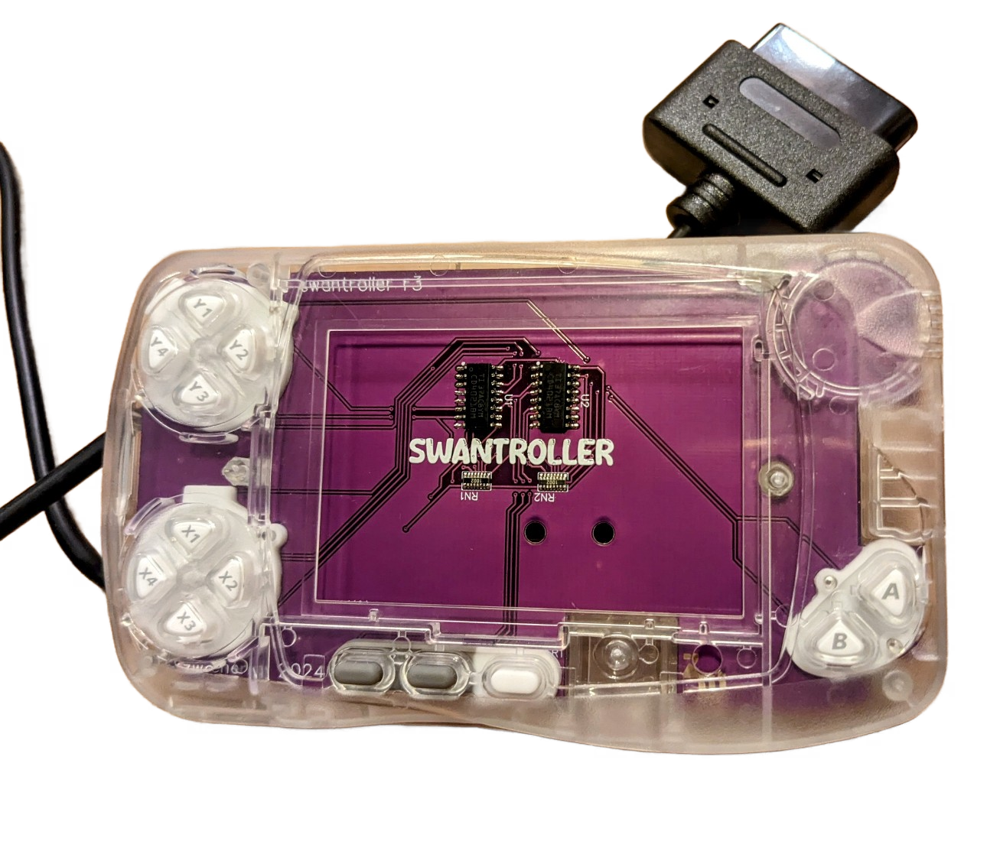
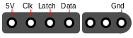

# swantroller
A WonderSwan Color controller PCB for the swancolorHD.

## About
The idea of this project is to turn an (empty) WonderSwan Color shell into a controller for the swancolorHD (a WonderSwan Color consolizer).

## Parts
| **Reference** | **Value**| **Links**
|---------------|----------|----------|
| U1, U2        | CD4021 Shift Register |[LCSC](https://www.lcsc.com/product-detail/Shift-Registers_Texas-Instruments-CD4021BM96_C134120.html)|
| RN1, RN2           | 10 kOhm Resistor Array |[LCSC](https://www.lcsc.com/product-detail/Resistor-Networks-Arrays_UNI-ROYAL-Uniroyal-Elec-16P8WGF1002T4E_C422188.html)|

Besides you need an **empty WonderSwan Color shell** (a replacement shell or an original shell with the display still installed should work) and a **SNES controller extension cable**.

## PCB
The controller PCB should be ordered with 1 mm thickness and ENIG.

## Connection
The easiest way to get a SNES controller cable is probably to get a SNES controller extension cable and cut off the female port.
Use a multimeter to figure out the signals.
Here's the signal pinout of the controller plug:

## Disclaimer
**Use the files and/or schematics to build your own board at your own risk**.
This board works fine for me, but it's a simple hobby project, so there is no liability for errors in the schematics and/or board files.
**Use at your own risk**.

